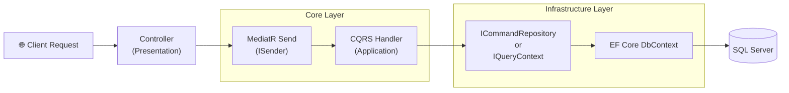

# 🚀 StokYönetim Pro
**(Kurumsal Stok & Sipariş Yönetim Backend'i)**

StokYönetim Pro, modern yazılım mimarisi prensipleri ile inşa edilmiş, ürün yönetimi, stok takibi ve sipariş süreçlerini uçtan uca yöneten profesyonel bir B2B ERP (Kurumsal Kaynak Planlama) çözümüdür. 

**ASP.NET Core 9.0** üzerinde **Clean Architecture** (Temiz Mimari) prensiplerine sadık kalınarak, enterprise standartlarında geliştirilmiş yüksek performanslı bir Headless API örneğidir.

---

## 🏗️ Mimari Tasarım (Clean Architecture)

Proje, katmanlı mimarinin sunduğu "Separation of Concerns" (Sorumlulukların Ayrışması) kuralını tam anlamıyla uygular:

**Katman Dağılımları:**
- **Domain Katmanı**: `BaseEntity` (ardışık GUID, soft delete özellikleri), iş kuralları ve domain sabitleri. (Toplam 35+ Entity)
- **Application Katmanı**: İş mantığı (Business Logic). CQRS modeli (Command & Queries ayrı ayrı), FluentValidation ile validasyonlar ve AutoMapper dönüşümleri.
- **Infrastructure Katmanı**: Entity Framework Core DbContext işlemleri, Repository Pattern, JWT tabanlı kimlik doğrulama, Loglama, Email ve Seed Data mekanizmaları.
- **Presentation (ASPNET) Katmanı**: Sadece HTTP isteklerini alıp `ISender` ile Application katmanına aktaran 35+ Controller.

---

## 🌟 Temel Özellikler Modülleri

- **Stok Modülü:**
  - Gerçek zamanlı envanter işlemleri (Inventory Transaction) sistemi.
  - Transfer, Fire (Scrapping), Sayım (Stock Count) yönetimi.
  - 🆕 Kritik stok seviyesi kontrolü (`/api/Product/GetLowStockProducts`).
  - 🆕 Depo bazlı genel stok değer raporu (`/api/InventoryTransaction/GetStockSummaryReport`).
- **Satış Modülü:** 
  - Satış Siparişleri (Sales Order), İadeler.
  - 🆕 Tarih bazlı satış özet raporlamaları (`/api/SalesOrder/GetSalesSummaryReport`).
- **Satınalma Modülü:** Satınalma Siparişleri, Teslimatlar (Goods Receive).
- **Cari Modülü:** Müşteri ve Tedarikçi (Vendor) yönetimi.

---

## 💻 Kurulum & Çalıştırma (Geliştirici)

Proje modern yapıda olmasına rağmen Monolithic Clean Architecture yaklaşımı sayesinde tek yerden yönetilir ("dependency nightmare" yoktur).

1. Projeyi bilgisayarınıza klonlayın.
2. `Indotalent.sln` çözüm dosyasını Visual Studio 2022+ ile açın.
3. `Presentation/ASPNET/appsettings.json` içerisindeki `DefaultConnection` adımını LocalDB veya SQL Server'ınıza göre güncelleyin.
4. Çözüme sağ tıklayıp "Build" deyin.
5. "Run" (Start) butonuna basın. Backend API `http://localhost:5000` adresinde ayağa kalkacaktır.
   - *Not: Entity Framework Core projeyi ilk kez çalıştırdığınızda veritabanını otomatik olarak (Code First) oluşturup tohumlayacaktır (Seed Data).*

---

## 🔐 Yetkilendirme (Auth)

Uygulama JWT (JSON Web Token) korumalıdır. API istekleri yapmadan önce Yetki almanız gerekir.
Başlangıç için varsayılan yetkili hesabı:
- **Kullanıcı adı:** `admin@root.com`
- **Şifre:** `123456`

---

## 📜 Lisans & Attribution Hakkında

Bu proje, açık kaynak topluluğuna katkı amacıyla geliştirilmiş ve taban kodu Indotalent ([whms-lte-fs.csharpasp.net](https://whms-lte-fs.csharpasp.net/)) WMS projesinden fork edilerek "StokYönetim Pro" olarak zenginleştirilmiştir. Orijinal eserin katkılarına saygı olarak orijinal projenin [Creative Commons Attribution 4.0 International License (CC BY 4.0)](http://creativecommons.org/licenses/by/4.0/) lisansı korunmuştur.
